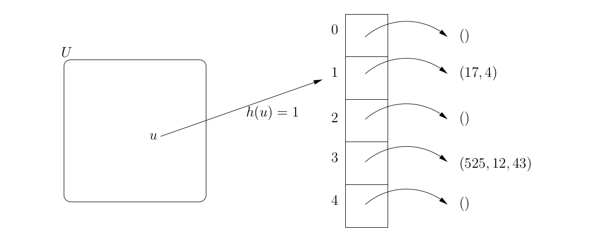

# 

# Algorithmique avancée

### IUT Montpellier-Sète – Département Informatique

## Hash Table

### 1 - Contexte

Les fonctions de hachage sont un outil classique de l’algorithmique 2 , dont une des principales application
est la suivante. On souhaite créer une structure de donnée T (pour table) pour y stocker un ensemble
d’objets S ⊆ U , dans un contexte où |S| est très petit devant |U|. Typiquement:

   * (Exemple 1) S représente l’ensemble des mots utilisés dans un texte donné, et U est l’ensemble
des chaînes d’au plus 30 caractères (en considérant que tous les mots utilisés dans le texte sont de
longueur au plus 30). 
   * (Exemple 2) S représente un ensemble de positions de sudoku 9x9 déjà rencontrées par un algorithme
d’exploration de type "brute force" (chaque élément de S est une matrice de 9 × 9 remplie d’entiers
entre 1 et 9), et U est l’ensemble de toutes les matrices 9 × 9 à coefficients entre 1 et 9.
   * (Exemple 3) S représente l’ensemble des adresses IP des personnes ayant visité un site web donné,
et U représente toutes les adresses IP possibles.

T définit pour avoir les deux propriétés suivantes :

   * (Propriété p1 ) on voudrait que la taille totale utilisée par la table |T| ne soit pas trop grande par
rapport au nombre d’éléments |S| à stocker : idéalement |T| ≤ c|S|, ou même |T| ≤ c|S| 2 , avec c
une petite constante, mais surtout pas |T| proche de |U|.
   * (Propriété p2 ) on voudrait que les opérations de base (insertion, suppression, recherche) soient très
rapides, au sens où elles n’exécutent que très peu d’opérations (par exemple un nombre constant,
c’est-à-dire borné par une certaine constante, ou logarithmique en |T|).

On considérera dans ce sujet l’exemple 1, qui est un cas dit statique dans lequel on connaît S à l’avance.
L’objectif est donc d’écrire un algorithme qui, étant donné un fichier de texte en entrée, construit une
table T ayant si possible les propriétés p1 et p2 . Cette table sera alors soumise à un très grand nombre de
recherches, l’objectif étant de minimiser le temps total de ces recherches (grâce à la propriété p2 ), tout en
garantissant un temps de construction et un espace mémoire utilisé raisonnable (grâce à la propriété p1 ).

#### 2 - Principe général d'une table de hachage

Les tables de hachage sont des structures de données typiquement utilisées pour obtenir ces deux pro-priétés. Comme c’est souvent le cas dans la littérature, nous allons d’abord nous intéresser au cas où U ⊆ N. Autrement dit, on s’intéresse au problème de construire une structure de données pour stocker un sous ensemble d’entiers S ⊆ U , tout en garantissant les propriétés p1 et p2 . Nous verrons ensuite comment ramener notre problème de stockage de mots d’un texte au problème de stockage des entiers, en convertissant chaque mot en un “grand” entier.

Voici maintenant le principe d’une table de hachage avec résolution dite par liste (ou par chaînage). On
commence par choisir une taille de tableau notée m, et une fonction h : U → [0, m − 1] appelée fonction
de hachage (nous verrons comment choisir h après). On définit alors T comme un tableau de m listes (cf
Figure 1).

Figure 1: Exemple d’une table de hachage avec résolution par chaînage pour m = 5. Cette table contient
les éléments {17, 4, 525, 12, 43}. L’élément u sera rajouté dans la liste T[1].

Ensuite,

   * pour ajouter un élément u ∈ U (qui n’est pas déjà dans T ), on ajoute u dans la liste T [h(u)]
   * pour rechercher un élément u ∈ U , on se contente de chercher seulement dans la liste T [h(u)]
   
Observez que pour tout i ∈ [0, . . . , m − 1], T [i] contient donc la liste de tous les entiers de la table
u ∈ U tels que h(u) = i. On peut faire l’analogie suivante entre T et un dictionnaire. Imaginez que U
contienne des chaînes de caractères composées uniquement de lettres minuscules, et que h soit à valeur
dans { 'a' , . . . , 'z' }. Supposons que, étant donnée une chaîne s ∈ U , on définisse h(s) comme la première
lettre de s. Alors, pour ajouter un nouveau mot s ∈ U dans le dictionnaire, on regarde la première lettre
h(s) et on rajoute s à la liste des mots commencant par h(s) ; et pour rechercher un mot s ∈ U , on se
contente de chercher seulement dans la liste des mots débutant par la lettre h(s).
On dit que deux éléments u1 != u2 de U sont en collision si h(u1) = h(u2). Notez que deux éléments
distincts (u1 != u2) peuvent tout à fait être en collision, et que tous les éléments d’une liste T [i] sont
d’ailleurs en collision. En revenant à l’analogie du dictionnaire, on constate que, par exemple, tous les
mots commencant par la lettre ’a’ sont en collision. A noter enfin qu’il existe d’autres techniques que les
listes pour gérer les collisions, mais que pour commencer nous allons coder ce type de tables de hachage.
On aimerait une fonction h qui :
      * soit rapide à calculer (un nombre constant d’opérations typiquement), sinon la propriété p 2 serait
déjà compromise.
      * qui "répartisse bien" les éléments, au sens où, après avoir ajouté tous les éléments de S, on aimerait
que chaque liste T[i] contienne environ |S|/m éléments.

Ainsi, en choisissant m = |S| par exemple, on espère que chaque liste soit de taille constante, c’est-à-dire
bornée par une certaine constante, et ainsi on aura les propriétés p 1 et p 2 3 .

#### 3 - Code de la table de Hachage

Une classe HTNaive définie ainsi. L’utilisateur choisira le nombre de listes m (et donc la taille du tableau), et on définit h à valeur dans {0, . . . , m − 1} par h(u) = u%m.
HTNaive correspondant à une table de hachage avec résolution par chaînage, et stockant des BigInteger. La table a comme propriété (invariant) qu’aucune des listes ne contient de doublons.
Une classe ListeBigI correspondant à une liste de BigInteger.
Une classe Dictionnaire permettant de stocker des mots (String) en se basant sur la classe HTNaive de la section précédente.

